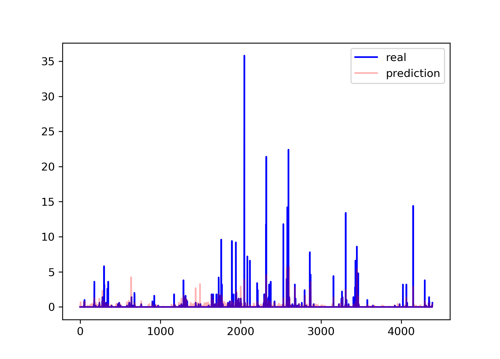

# 环境搭建

从纯裸的windows上跑通，步骤是：

### 安装anaconda3最新版2020.02

​    网址  <https://repo.anaconda.com/archive/Anaconda3-2020.02-Windows-x86_64.exe>

### 从清华源安装pytorch1.5cpu版：

`conda config --add channels https://mirrors.tuna.tsinghua.edu.cn/anaconda/cloud/pytorch/`

`conda config --add channels https://mirrors.tuna.tsinghua.edu.cn/anaconda/pkgs/free/`

`conda config --add channels https://mirrors.tuna.tsinghua.edu.cn/anaconda/pkgs/main/`

` conda config --set show_channel_urls yes `

`conda install pytorch torchvision cpuonly`

### 从清华源安装xgboost 

`pip install xgboost -i https://pypi.tuna.tsinghua.edu.cn/simple`


# rain_shuffle代码部分

该部分为主要实现降水量预测的代码

其主要由以下几个部分构成

## hour_data文件夹

该文件夹主要保存经过预处理的对应每个气象站id的数据，csv格式

## train_test_hour文件夹

该文件夹主要保存每个气象站预处理后的数据的特征和标签文件，以9:1分为训练集和测试集，其中训练和测试集未打乱，按时间先后顺序划分。

## train_test_hour_shuffle文件夹

该文件夹主要保存每个气象站预处理后的数据的特征和标签文件，以9:1分为训练集和测试集，其中训练和测试集打乱划分。

## MODEL文件夹

主要用来存放需要进行模型集成的训练好的单独模型，属于打乱数据集模型

## MODEL_NO文件夹

主要用来存放需要进行模型集成的训练好的单独模型，属于未打乱数据集模型

## hour_cat.py

将原始数据文件按单个气象站拆分，并搜索其中数据量较大的数据集，再对其中的缺失值进行填补，最后保存在`hour_data`文件夹

## corr_data.py

测试不同气象参数的相关性 采用皮尔逊系数^[1]^，并绘制相关曲线

> [[1]参考链接](https://baike.baidu.com/item/皮尔逊相关系数/12712835?fromtitle=皮尔逊系数&fromid=16955304&fr=aladdin)

## hour2txt_ifshuffle.py

通过选择其中的参数，可以修改处理数据的方式，得到是否打乱的数据或者特征代表的时间长度，还有测试集的比例

```python
time_ser = 3 #小时数
ratio = 0.9
ifshuffle = False
```

上述为可以调整的对应参数。

## eval.py
主要包括：
1. 评估模型的各个指标

    ```python
    def evaluation(a,b):
        rmse = np.sqrt(mean_squared_error(a,b))
        mae = mean_absolute_error(a, b)
        var = explained_variance_score(a,b)
        mdae =median_absolute_error(a,b)
        r2 =r2_score(a,b)
        return rmse, mae, mdae, r2, var
    ```
    具体参考sklearn.metrics的库函数
2. 模型结果的后处理

## ARIMA.py

arima的方法训练模型 采用一步预测 所有数据预测下一时刻

使用数据的10%做测试集 画出预测和测试集的效果

## SVR_rbf.py

核函数为rbf的svr模型 

训练集：验证集：测试集：7:2:1

归一化特征参数 sklearn.preprocessing.scale函数

超参数：gamma  C 

训练不同超参数，保存训练集mse和验证集mse，取验证集最好的mse为最优模型并保存

加载保存模型， 在测试集测试，画图，使用eval.py评估

## SVR_sigmoid.py

核函数为sigmoid

同上 但超参数范围不同

## SVR_poly.py

核函数为多项式

同上 但超参数多一个 degree （具体见svr的参数）

## MLP_module.py

mlp神经网络的class模块 

实现功能：

    1. 初始化函数： 
       输入维度  隐藏单元个数 层数 学习率 batch大小
    2. fit函数：分割训练集 验证集
    ​   训练模型返回最优验证集mse 并保存模型和中间结果
    3. predict函数：加载模型
    ​   打印测试集上的mse 和 返回预测值

## mlp.py

mlp实现的主文件

读取文件

训练模型

评估模型

也可以通过人工修改超参数 保存的模型的数据均是带有参数的文件名。

## LSTM_module.py

Last神经网络的class模块 

实现功能：

1.初始化函数： 输入维度 序列的长度  隐藏单元个数 层数 学习率 batch大小

2.fit函数：分割训练集 验证集

​		训练模型返回最优验证集mse 并保存模型和中间结果

3.predict函数：加载模型

​			打印测试集上的mse 和 返回预测值

## lstm_.py

mlp实现的主文件

读取文件

训练模型

评估模型

也可以通过人工修改超参数 保存的模型的数据均是带有参数的文件名。

## GBRT.py

GBRT模型 

训练集：验证集：测试集：7:2:1

归一化特征参数 sklearn.preprocessing.scale函数

超参数：学习率（learning_rate） 树的个数（n_estimators） 树的深度（max_depth）

训练不同超参数，保存训练集mse和验证集mse，取验证集最好的mse为最优模型并保存

加载保存模型， 在测试集测试，画图，使用eval.py评估

## XGB.py

XGBoost模型 

训练集：验证集：测试集：7:2:1

归一化特征参数 sklearn.preprocessing.scale函数

超参数：学习率（learning_rate） 树的个数（n_estimators） 树的深度（max_depth）

训练不同超参数，保存训练集mse和验证集mse，取验证集最好的mse为最优模型并保存

加载保存模型， 在测试集测试，画图，使用eval.py评估

## seq2seq_module.py

​	Seq2seq神经网络的class模块 

实现功能：

1.初始化函数： 输入维度 序列的长度  隐藏单元个数  学习率 batch大小

2.fit函数：分割训练集 验证集

​		训练模型返回最优验证集mse 并保存模型和中间结果

3.predict函数：加载模型

​			打印测试集上的mse 和 返回预测值	

## seq2seq.py

seq2seq实现的主文件

读取文件

训练模型

评估模型

也可以通过人工修改超参数 保存的模型的数据均是带有参数的文件名。

## att_seq2seq_module.py		

​		att_Seq2seq神经网络的class模块 (带注意力机制)

实现功能：

1.初始化函数： 输入维度 序列的长度  隐藏单元个数  学习率 batch大小

2.fit函数：分割训练集 验证集

​		训练模型返回最优验证集mse 并保存模型和中间结果

3.predict函数：加载模型

​			打印测试集上的mse 和 返回预测值	

​	

## att_seq2seq.py

att_seq2seq实现的主文件

读取文件

训练模型

评估模型

也可以通过人工修改超参数 保存的模型的数据均是带有参数的文件名。

## ensemble_learn.py

基础模型训练代码 打乱数据

包含bagging方法和stacking方法

## ensemble_learn_np.py

基础模型训练代码 未打乱数据

包含bagging方法和stacking方法

## test.py

加载模型测试`sample`文件夹中的测试集

# 训练过程

### 数据集准备

首先在链接处下载数据集[小时天气数据](https://cloud.tsinghua.edu.cn/d/a96c9fb8f56d4fb5be62/)

解压其中的`hourly-weather-surface.zip`文件，可以得到`sudeste.csv`文件，并将该文件放入`rain_shuffle`文件夹中。

### 构建训练和测试集

在terminal终端进入`rain_shuffle`文件夹，然后在文件夹中执行

```
python hour_cat.py
```

然后再继续执行

```
python hour2txt_ifshuffle.py
```

### 训练及测试

继续在该文件夹中，运行以下指令即可训练模型

```
python seq2seq.py --station 313  --epochs 100 --batch-size 30  --lr 1e-3 --input-dim 3  --seq-len 7
```

其中`seq2seq.py`是训练模型的代码，可以根据之前的介绍改成任意模型的代码名称，`-—statoin`代表所选的气象站的id，`--epochs`为训练代数。

执行该文件后，你可以训练得到对应的模型以及输出对应的测试集结果，可以得到RMSE，MAE，MDAE，r2-score，可释方差得分var等得分。

### 在测试样例上测试

首先将上一个文件夹中的`testset`文件夹中的`station313`~`station393`文件夹转移到`rain_shuffle`文件夹的` sample`文件夹，然后运行下列代码得到验证结果

```
python test.py --station 313 --model_type seq2seq --model SEQ2SEQ/seq2seq_313_128_0.1_0.001.pth 
```

其中可以通过更换`—-station`的参数来改变要去求解的测试样例，`—model_type`是模型的类型，需要和后面选择的模型对应。

==注==：在选择模型时必须选择和station匹配的模型，例如上述station为313，则需要找到为`seq2seq_313_128_0.1_0.001.pth`的模型，其中被`_`隔开的第一个数字代表所匹配的station。

执行该文件后，你可以训练得到对应的模型以及输出对应的测试集结果，可以得到RMSE，MAE，MDAE，var，r2-score等得分。

### 下载训练好的模型和测试样例

首先下载训练好的模型[训练模型](https://cloud.tsinghua.edu.cn/d/2fd811c7400748eabd72/)

找到其中的

```
seq2seq_313_best.pth
seq2seq_314_best.pth
seq2seq_371_best.pth
seq2seq_372_best.pth
seq2seq_393_best.pth
```

文件下载后放入`models`文件夹，后继续在`rain_shuffle`文件夹下使用下述命令：

```
python test.py --station 313 --model_type seq2seq --model models/seq2seq_313_best.pth 
```

其中可以通过更换`—-station`的参数来改变要去求解的测试样例，`-—model_type`是模型的类型，需要和后面选择的模型对应。

==注==：但在选择模型时必须选择和station匹配的模型，例如上述station为313，则需要找到为`seq2seq_313_best.pth`的模型，其中被`_`隔开的第一个数字代表所匹配的station。

**以下为理想的输出结果**：

## station313:

    SEQ2SEQ_rmse: 0.7847012 
    SEQ2SEQ_mae: 0.17579529 
    SEQ2SEQ_mdae: 0.0 
    SEQ2SEQ_r2: 0.25680770788051666 
    SEQ2SEQ_var: 0.2615431547164917


## station314:

    SEQ2SEQ_rmse: 0.7056168 
    SEQ2SEQ_mae: 0.1004589 
    SEQ2SEQ_mdae: 0.0 
    SEQ2SEQ_r2: 0.23950347308864373 
    SEQ2SEQ_var: 0.24046140909194946


## station371:

    SEQ2SEQ_rmse: 0.92071176 
    SEQ2SEQ_mae: 0.13802044 
    SEQ2SEQ_mdae: 0.0 
    SEQ2SEQ_r2: 0.18028592369689478 
    SEQ2SEQ_var: 0.180952787399292



## station372:

    SEQ2SEQ_rmse: 0.56710863 
    SEQ2SEQ_mae: 0.13634275 
    SEQ2SEQ_mdae: 0.0 
    SEQ2SEQ_r2: 0.253192955761976 
    SEQ2SEQ_var: 0.2590576410293579


## station393:

    SEQ2SEQ_rmse: 0.92203474 
    SEQ2SEQ_mae: 0.16005377 
    SEQ2SEQ_mdae: 0.0 
    SEQ2SEQ_r2: 0.18053682665056303 
    SEQ2SEQ_var: 0.18120914697647095


